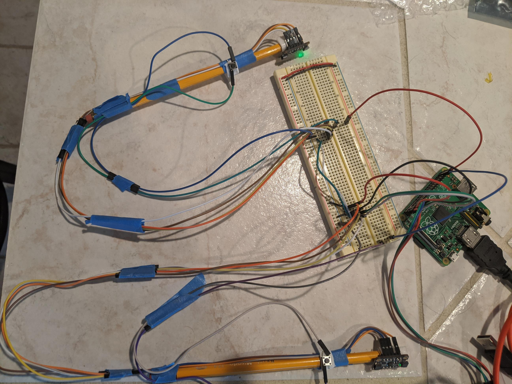
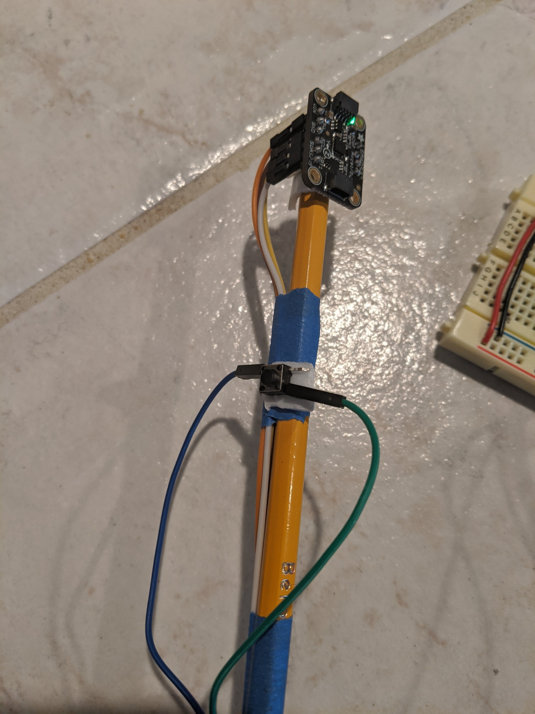

# Air Snare
CS107e Final Project Spring 2020

## Overview
This project involved creating a drum machine that you can play by just swinging the drumsticks in the air! It uses two drumsticks (pencils), each with an LSM6DS33 IMU and a pushbutton. The IMUs sense the motion of the sticks and the Pi reads the data from them to decide when to play a sound. If the button is pressed when a stick is swung, it plays a different sound. Currently, one stick plays a snare drum when the button isn't pressed and a kick drum when the button is pressed. The other plays a hi-hat or a crash cymbal. The sound is sent through HDMI and outputted via the speakers on your HDMI monitor/TV.

## Video Demo
A video demo can be found [here](https://youtu.be/LqtsvDemBYs).

## Block Diagram
A high level overview of what's going on:

## Pictures
A picture of the full system:

A closeup of one drumstick:
